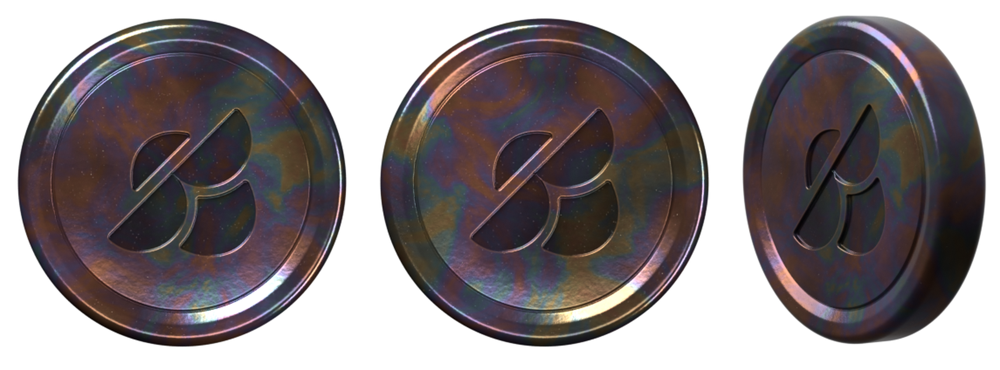
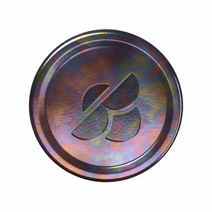

# The clay coins, in 3D

Replicas of the glazed clay coin in `reference/`, built from those two photos,
as GLBs to use in After Effects. Two so far, from the same tools:

- **`coin-hole.glb`**, the coin as it is, with its hole;
- **`coin-logo.glb`**, the same coin without the hole, with the Beetle logo
  pressed into both faces.






## What is here

| File | What it is |
| --- | --- |
| `coin-hole.glb` | The coin with the hole. One mesh, one material, its three textures inside. |
| `coin-logo.glb` | The coin with the logo. The same, laid out the same way. |
| `textures/` | Each coin's three textures as loose files (`coin-hole_*`, `coin-logo_*`), if you want to grade or swap them. |
| `previews/` | The coin with the hole beside each photo, lit the way that photo was (`compare.png`), and the silhouette fit against the angled photo (`angle_fit.png`: grey where both agree, red photo only, blue model only). The coin with the logo from the front, the back, the photo's angle and close up (`logo_*.png`). A turntable of each. |
| `reference/` | The two photos it was measured from, and the Beetle logo: the picture it came as (`beetle-logo.png`) and the clean vector rebuilt from it (`beetle-logo.svg`). |
| `tools/` | The scripts that measure the photos and the logo and build the coins. |

### The coin with the hole

- **Size:** 40 mm across and 7.2 mm thick at the rim, in real units
  (glTF is in metres). The real coin's size is not in the photos, so 40 mm is a
  stand-in: every proportion is measured, only the overall scale is chosen.
  The hole is 17.9 × 13.1 mm at its narrowest.
- **Placed:** standing up, facing the camera (+Z), the hole's point up (+Y),
  the pivot dead in the middle of the coin. Spin it on Y and it turns like a
  coin on its edge.
- **Mesh:** 79,365 vertices, 157,440 triangles, smooth all over, no
  creases or seams in the shading. It is one closed surface.
- **Material:** "Glazed clay", standard metal/roughness PBR:
  - colour (`coin-hole_basecolor.jpg`): a near-black brown body under a lustre that runs
    bronze, copper, plum, blue, teal and brass in soft patches, with pinholes
    and the odd pale fleck;
  - occlusion, roughness and metal packed in one
    (`coin-hole_occlusion-roughness-metallic.jpg`, in red, green and blue):
    glossy, about 0.15 to 0.25 rough; the lustre is mostly metal, which is what
    makes reflections take its colour, as they do on the real glaze;
  - a normal map (`coin-hole_normal.png`) for the glaze's slow waves, its orange peel and
    the pinholes.
  All three are 4096 × 1024, wrapped round the coin once each way, so there is
  no visible seam.

### The coin with the logo

- **The same coin:** the same 40 × 7.2 mm, the same rim, groove and side, the
  same glaze, placed the same way (logo upright, +Y). Inside the groove the
  field carries on level across the middle, where the hole was.
- **The logo** is 17.9 mm across, centred, pressed 0.5 mm into the field, its
  walls rounded over the way clay rounds under a stamp. The glaze runs into the
  pressing and lies thicker there, darker and glossier, and breaks a little
  lighter on the edge above, as glaze does.
- **The back** is the same as the front. The logo there is mirrored in the
  model, so that it reads the right way round when the coin is turned over.
- **Mesh:** 104,203 vertices, 206,268 triangles, one closed
  surface: dense where the logo's walls are, light on the flat.
- **Material:** the same three textures, here 4096 × 4096 (the normal map
  2048 × 2048): the front and back faces each have a square of their own, and
  the rim and side run along the bottom half.

## Using it in After Effects

Needs After Effects 24.1 or later.

1. **Import** `coin-hole.glb` or `coin-logo.glb` (File › Import). Drag it into a comp; it comes in
   as a 3D model layer.
2. **Renderer:** Composition Settings › 3D Renderer › **Advanced 3D**.
3. **Size:** in the layer's Model Settings, either choose **Make Comp Size**,
   or keep the real size with Model Units set to millimetres or centimetres and
   scale from there.
4. **Light it with an environment.** Layer › New › Light › **Environment**, and
   give it an HDRI. This matters more than anything else: like the real coin,
   the glaze is mostly reflection, so with only point or spot lights it looks
   almost black. A studio HDRI with a few softboxes on a dark room gives the
   front photo's look (dark brown, bright edges, colour where the light catches);
   a bright, even one gives the angled photo's (the lustre all over).
5. **Spin** with Y Rotation. The hole is see-through, so put something behind
   the coin that has one.

Nothing in the file is beyond the core glTF material, so it looks the same in
any viewer that reads GLB.

## How it was made

Everything is measured, not eyeballed.

- **The outline and the hole** come from the front photo's cut-out: the coin's
  edge is a circle to within a pixel (radius 187.9 px), and the hole is traced
  where the photo's transparency changes, in units of that radius, then
  mirrored and averaged left to right. Its bowl is very nearly a circle of 0.40
  R about the coin's centre; its top is two inward-curving lobes that meet in a
  rounded point 0.256 R above the centre; its corners reach 0.447 R either side.
- **The hole sits 0.025 R (half a millimetre) left of centre.** Both photos
  agree on this, so the model keeps it: it is part of this coin.
- **The thickness** is hidden in the front photo, so `fit_thickness.py` puts the
  model in front of a pinhole camera and searches for the camera's angle,
  distance and framing together with the thickness, until the model's outline
  and the daylight through its hole match the angled photo's. Every start it
  was given lands within a few per cent of the same answer: 18 % of the
  diameter, seen from 51° off the coin's axis through a long lens. There the
  model's silhouette and the photo's differ by under 1 % of the picture.
- **The face**, from the photos' highlights: a straight hole wall, rolled over
  into a bead that runs round the hole; a field that dips softly below the bead
  and rises to a fine groove at 0.78 R (the thin bright line in the front
  photo); a raised rim that rounds over into a straight side wall. Front and back
  are mirror images.
- **The glaze** is procedural, read off the photos' colours, then baked into the
  three textures the GLB carries.

### Rebuilding it

The tools run on Blender's Python module, without Blender itself:

```sh
python -m venv .venv && . .venv/bin/activate
pip install bpy numpy scipy scikit-image pillow svgpathtools   # bpy 5.2 wants Python 3.13; ffmpeg for the turntable

cd coin/tools
python measure_hole.py ../reference/front.png hole_outline.json   # the hole, from the photo
python fit_thickness.py ../reference/angle.png                      # the thickness and the camera -> fit_camera.json
python build_coin.py --turntable 96                                 # the coin with the hole: textures, GLB, previews
python build_coin.py --variant logo --turntable 96                  # the coin with the logo (reads ../reference/beetle-logo.svg)
python build_coin.py --look                                         # quick renders while tuning the glaze
python build_coin.py --turntable-only --turntable 96                # just the spin, from the textures already baked
python trace_logo.py ../reference/beetle-logo.png ../reference/beetle-logo.svg   # the logo, as a vector
```

`fit_thickness.py` reports the thickness; it goes into `PARAMS["thickness"]` in
`coin_geometry.py`, which holds every dimension in one place, in units of
the coin's radius. The glaze's colours are at the top of the material section
of `build_coin.py`.

### The logo

`trace_logo.py` does not follow the logo picture's pixels, which are hard
steps. It finds each edge, fits the true line, circle or ellipse to it and the
radius of each rounded tip, and draws the logo again from those. That is what it
is made of: both straight edges run at exactly 45°; the long shape's two lobes
are circles of one radius; the lower piece's two hollow sides are circles of
another; the two remaining curves are ellipses whose axes lie on the same
diagonal; and every tip is rounded at about the same radius. The rebuilt
outline sits within 0.4 px of the picture's on average, about as close as its
pixel steps allow.
