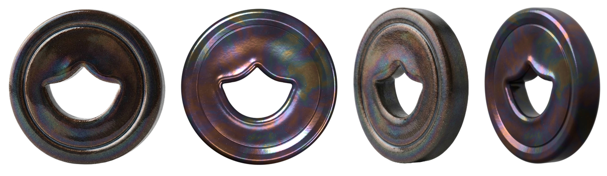
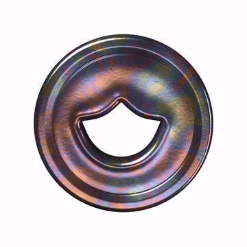

# The clay coin, in 3D

A replica of the glazed clay coin in `reference/`, built from those two photos,
as a GLB to use in After Effects. This is the first of three: the coin with the
hole. The others (one without the hole, and a third) come next, from the same
tools.





## What is here

| File | What it is |
| --- | --- |
| `coin-hole.glb` | The model. One mesh, one material, its three textures inside. |
| `textures/` | The same three textures as loose files, if you want to grade or swap them. |
| `previews/` | The model beside each photo, lit the way that photo was (`compare.png`); the silhouette fit against the angled photo (`angle_fit.png`: grey where both agree, red photo only, blue model only); and a turntable. |
| `reference/` | The two photos it was measured from. |
| `tools/` | The scripts that measure the photos and build the model. |

### The model

- **Size:** 40 mm across and 7.2 mm thick at the rim, in real units
  (glTF is in metres). The real coin's size is not in the photos, so 40 mm is a
  stand-in: every proportion is measured, only the overall scale is chosen.
  The hole is 17.9 × 13.1 mm at its narrowest.
- **Placed:** standing up, facing the camera (+Z), the hole's point up (+Y),
  the pivot dead in the middle of the coin. Spin it on Y and it turns like a
  coin on its edge.
- **Mesh:** 79,365 vertices, 157,440 triangles, smooth all over, no
  creases or seams in the shading. It is one closed surface.
- **Material:** "Glazed clay", standard metal/roughness PBR:
  - colour (`coin-hole_basecolor.jpg`): a near-black brown body under a lustre that runs
    bronze, copper, plum, blue, teal and brass in soft patches, with pinholes
    and the odd pale fleck;
  - occlusion, roughness and metal packed in one
    (`coin-hole_occlusion-roughness-metallic.jpg`, in red, green and blue):
    glossy, about 0.15 to 0.25 rough; the lustre is mostly metal, which is what
    makes reflections take its colour, as they do on the real glaze;
  - a normal map (`coin-hole_normal.png`) for the glaze's slow waves, its orange peel and
    the pinholes.
  All three are 4096 × 1024, wrapped round the coin once each way, so there is
  no visible seam.

## Using it in After Effects

Needs After Effects 24.1 or later.

1. **Import** `coin-hole.glb` (File › Import). Drag it into a comp; it comes in
   as a 3D model layer.
2. **Renderer:** Composition Settings › 3D Renderer › **Advanced 3D**.
3. **Size:** in the layer's Model Settings, either choose **Make Comp Size**,
   or keep the real size with Model Units set to millimetres or centimetres and
   scale from there.
4. **Light it with an environment.** Layer › New › Light › **Environment**, and
   give it an HDRI. This matters more than anything else: like the real coin,
   the glaze is mostly reflection, so with only point or spot lights it looks
   almost black. A studio HDRI with a few softboxes on a dark room gives the
   front photo's look (dark brown, bright edges, colour where the light catches);
   a bright, even one gives the angled photo's (the lustre all over).
5. **Spin** with Y Rotation. The hole is see-through, so put something behind it.

Nothing in the file is beyond the core glTF material, so it looks the same in
any viewer that reads GLB.

## How it was made

Everything is measured, not eyeballed.

- **The outline and the hole** come from the front photo's cut-out: the coin's
  edge is a circle to within a pixel (radius 187.9 px), and the hole is traced
  where the photo's transparency changes, in units of that radius, then
  mirrored and averaged left to right. Its bowl is very nearly a circle of 0.40
  R about the coin's centre; its top is two inward-curving lobes that meet in a
  rounded point 0.256 R above the centre; its corners reach 0.447 R either side.
- **The hole sits 0.025 R (half a millimetre) left of centre.** Both photos
  agree on this, so the model keeps it: it is part of this coin.
- **The thickness** is hidden in the front photo, so `fit_thickness.py` puts the
  model in front of a pinhole camera and searches for the camera's angle,
  distance and framing together with the thickness, until the model's outline
  and the daylight through its hole match the angled photo's. Every start it
  was given lands within a few per cent of the same answer: 18 % of the
  diameter, seen from 51° off the coin's axis through a long lens. There the
  model's silhouette and the photo's differ by under 1 % of the picture.
- **The face**, from the photos' highlights: a straight hole wall, rolled over
  into a bead that runs round the hole; a field that dips softly below the bead
  and rises to a fine groove at 0.78 R (the thin bright line in the front
  photo); a raised rim that rounds over into a straight side wall. Front and back
  are mirror images.
- **The glaze** is procedural, read off the photos' colours, then baked into the
  three textures the GLB carries.

### Rebuilding it

The tools run on Blender's Python module, without Blender itself:

```sh
python -m venv .venv && . .venv/bin/activate
pip install bpy numpy scipy scikit-image pillow   # bpy 5.2 wants Python 3.13; ffmpeg for the turntable

cd coin/tools
python measure_hole.py ../reference/front.png hole_outline.json   # the hole, from the photo
python fit_thickness.py ../reference/angle.png                      # the thickness and the camera -> fit_camera.json
python build_coin.py --turntable 72                                 # textures, GLB, previews
python build_coin.py --look                                         # quick renders while tuning the glaze
python build_coin.py --turntable-only --turntable 96                # just the spin, from the textures already baked
```

`fit_thickness.py` reports the thickness; it goes into `PARAMS["thickness"]` in
`coin_geometry.py`, which holds every dimension in one place, in units of
the coin's radius. The glaze's colours are at the top of the material section
of `build_coin.py`.
